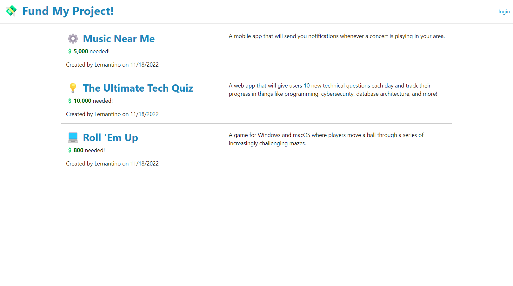

# Crowdfunding App

## Description

In this project I am building a full-stack crowdfunding app using Node.js, Express.js, Sequelize, Handlebars.js, and MVC architecture.

## Installation 


    bcrypt
    connect-session-sequelize
    express
    express-handlebars
    express-session
    mysql2
    sequelize
    
  
## User Stories

Once all the packages have been onstalled, run the following commend in the termianl:
```
npm run seeds
npm start
```


## Link To Deplyed Webpage

## Mock Up




### Acceptance Criteria
```
* It's done when the `/` homepage route renders a list of all projects from the database.

* It's done when the `/project/:id` route renders an individual project's details based on the route parameter id.

* It's done when the `/login` route renders a form to log in and a form to create a new account.

* It's done when an existing user can enter their credentials on the login page to create a session on the server.

* It's done when a new user can create an account on the login page and then be immediately logged in with a session.

* It's done when the `/profile` route renders the logged-in user's projects and a form to create a new project.

* It's done when only a logged in user can visit the `/profile` route.

* It's done when a logged in user is redirected to `/profile` when they try to visit `/login` again.

* It's done when a user on the profile page can use the form to create a new project in the database.

* It's done when a user on the profile page can select a "Delete" button to remove their project from the database.

* It's done when a logged-in user can select a "Logout" button to remove their session.

* It's done when the session for a logged-in user expires after a set time.

* It's done when the API routes to create and delete posts are protected from non logged-in users.

* It's done when the code is organized using MVC architecture.

* It's done when the views are rendered with Handlebars.js templates.

## Specifications 

* The database models have the following fields and associations:

  * `User`

    * `id`: primary key

    * `name`

    * `email`

    * `password`

  * `Project`

    * `id`: primary key

    * `name`

    * `description`

    * `date_created`

    * `needed_funding`

    * `user_id`: foreign key that references `User.id`

  * Users have many projects, and projects belong to a user.

    * If a user is deleted, all associated projects are also deleted.

---
```


© 2022 edX Boot Camps LLC. Confidential and Proprietary. All Rights Reserved.
